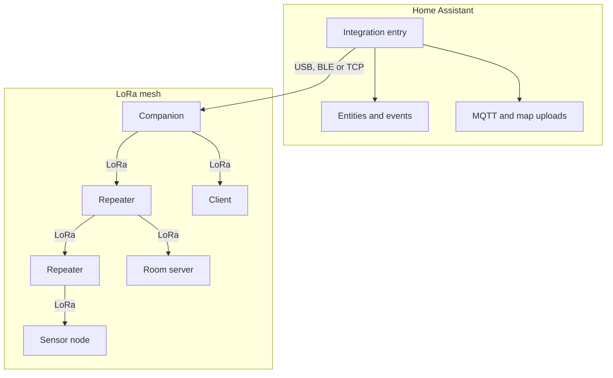

# Concepts

MeshCore is a LoRa mesh network. Each MeshCore device is a node. Repeaters relay messages to nodes that are out of range.

The integration connects Home Assistant to the mesh through one node, the **companion**. With the integration, Home Assistant can:

- Send and receive direct messages and channel messages.
- Poll repeaters, room servers, sensor nodes and clients, and show the results as sensors.
- Show the contacts that the companion knows or hears.
- Fire events for automations.
- Upload mesh packets to MQTT brokers and node adverts to the community map.

## How the parts connect

From Home Assistant to the mesh, each request passes the traffic policy first. A metered request must get one credit from a lane. Then the companion sends the request over a known route, or as a flood request when it has no route. See [Mesh Traffic Policy](traffic-policy.md).

The integration does not use the Home Assistant MQTT integration. It connects to each MQTT broker directly. See [MQTT Upload](mqtt.md).

## Glossary

| Term | Meaning | More information |
|---|---|---|
| ACL | The access control list of a repeater or room server. A node in the list can log in without a password. The node firmware keeps the list. | [Remote Node Tracking](remote-device-tracking.md) |
| advert | A packet that a node sends to announce its name, public key, node type and, as an option, its position | [Contact Management](contacts.md) |
| channel | A group conversation with an index, a name and a 16-byte secret key. Channel 0 is the Public channel. | [Messaging](messaging.md) |
| client | A node of type 1. Each companion is a client. | [Remote Node Tracking](remote-device-tracking.md) |
| companion | The node that Home Assistant connects to over USB, BLE or TCP. Each entry has one companion. | [Installation](installation.md) |
| contact (added) | A node in the contact list of the companion. You can send it direct messages and poll it. | [Contact Management](contacts.md) |
| contact (discovered) | A node that the companion heard in an advert but did not store. You cannot send it a direct message. | [Contact Management](contacts.md#contact-discovery-mode) |
| credit | One unit in a lane. Each metered mesh request uses one credit. | [Mesh Traffic Policy](traffic-policy.md#metered-requests) |
| entry | The integration entry in Home Assistant, one for each companion | [Two or more companions](multiple-companions.md) |
| flood request | A request with no known route. Every repeater that receives it retransmits it. | [Mesh Traffic Policy](traffic-policy.md) |
| flood scope | A region name that limits a flood. The `scope` field of `send_channel_message` sets it for an outgoing message. For incoming channel messages, the integration compares the scope with the names in **Flood Scope Allowlist**. The repeater firmware decides where a scoped flood goes. | [Services](services.md#send-channel-message), [Global Settings](installation.md#global-settings) |
| Global Settings | The options menu item that holds the settings of an entry | [Installation](installation.md#post-installation-configuration) |
| hashtag channel | A channel whose name starts with `#`. The key comes from the name, so all nodes that use the same name share the channel. | [Messaging](messaging.md) |
| lane | One of the three budgets of the traffic policy: flood, direct and messages | [Mesh Traffic Policy](traffic-policy.md) |
| Manage Monitored Devices | The options menu item that edits or removes a tracked node | [Remote Node Tracking](remote-device-tracking.md) |
| Manage MQTT Brokers | The options menu item that adds, edits or removes MQTT brokers | [MQTT Upload](mqtt.md) |
| poll | A request that the integration sends to a tracked node on a schedule: status, telemetry or neighbors | [Remote Node Tracking](remote-device-tracking.md) |
| public key prefix | The first hex characters of the public key of a node. The pages write `<pk6>`, `<pk10>` and `<pk12>` for 6, 10 and 12 characters, and `<node pk6>` for a second node. Entity IDs contain them. | [Contact Management](contacts.md#contact-entities) |
| repeater | A node of type 2 that relays packets for other nodes | [Remote Node Tracking](remote-device-tracking.md) |
| room server | A node of type 3 that keeps messages for the clients that log in to it | [Remote Node Tracking](remote-device-tracking.md) |
| route | The path that the companion uses to reach a node, in the `out_path` field. An `out_path_len` of `-1` means no route. | [Sensors](sensors.md#route-and-reliability-sensors) |
| routed request | A request sent over a known route. Only the repeaters on the route retransmit it. | [Mesh Traffic Policy](traffic-policy.md) |
| RX_LOG | The `RX_LOG_DATA` event: one for each packet that the companion receives. The integration uses it to count the repeats of a channel message. | [Messaging](messaging.md#rx_log-correlation) |
| sensor node | A node of type 4 that reports sensor data | [Remote Node Tracking](remote-device-tracking.md) |
| telemetry (Cayenne LPP) | Sensor readings in the Cayenne LPP format. Each value becomes a sensor. A GPS value becomes a device tracker. | [Sensors](sensors.md) |
| tracked node | A repeater, room server, sensor node or client that you add for monitoring | [Remote Node Tracking](remote-device-tracking.md) |
| traffic policy | The rules that limit the mesh requests of the integration. New entries use the Governed policy with three lanes. | [Mesh Traffic Policy](traffic-policy.md) |

For installs from 2.x that still use the deprecated Legacy policy, see [Legacy traffic policy](legacy-traffic-policy.md).
