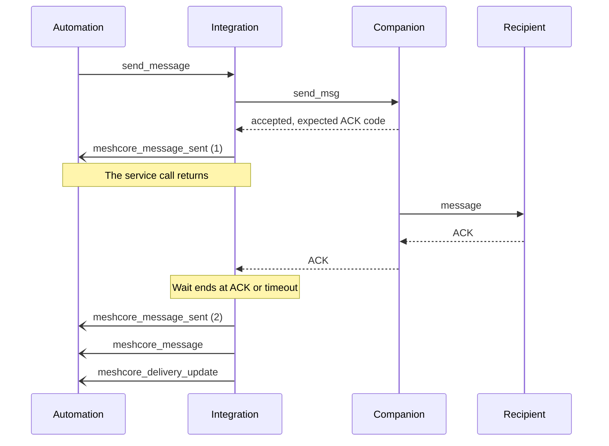
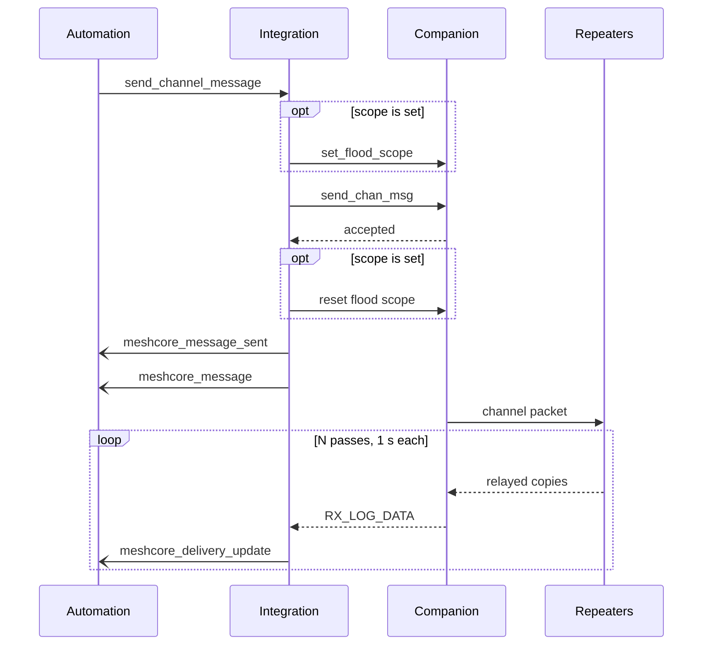
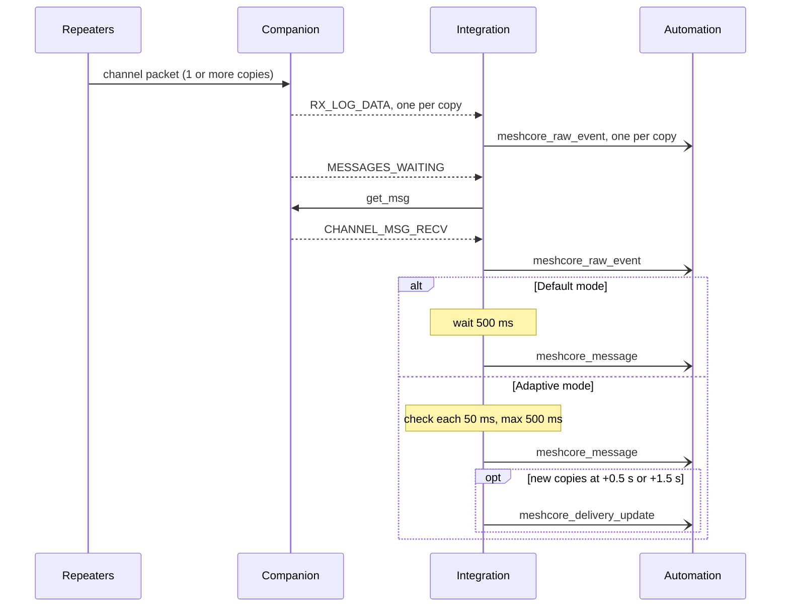

# Events

The integration fires eight event types on the Home Assistant event bus. For automation examples, see [Automation](automation.md).

| Event | When it fires | In the logbook |
|---|---|---|
| [`meshcore_message`](#meshcore_message) | A message arrives, or the integration logs a message that it sent | Yes |
| [`meshcore_delivery_update`](#meshcore_delivery_update) | New delivery data arrives for a message that `meshcore_message` already announced | No |
| [`meshcore_message_sent`](#meshcore_message_sent) | The companion accepts a message from `send_message` or `send_channel_message` | No |
| [`meshcore_message_send_failed`](#meshcore_message_send_failed) | A message from `send_message` or `send_channel_message` did not leave the companion | No |
| [`meshcore_raw_event`](#meshcore_raw_event) | The meshcore-py library reports an event from the companion | No |
| [`meshcore_cli_response`](#meshcore_cli_response) | `execute_command` or `execute_command_ui` completes with `record_to_console: true` | No |
| [`meshcore_connected`](#connection-events) | The link to the companion opens or opens again | No |
| [`meshcore_disconnected`](#connection-events) | The link to the companion closes or is lost | No |

## Fields on every event

### Which companion fired the event

| Field | Type | Description |
|---|---|---|
| `entry_id` | string | The entry (companion) that fired the event. Filter on it when you have more than one companion. |
| `device_id` | string or null | The device registry ID of that companion. It is `null` before the integration registers the device. |

To find these IDs, see [Select the entry](services.md#select-the-entry). On `meshcore_cli_response`, `entry_id` is the entry that the service call named. See [meshcore_cli_response](#meshcore_cli_response).

### Timestamps

| Event | `timestamp` format | Example |
|---|---|---|
| `meshcore_message`, `meshcore_delivery_update` | ISO 8601 string, UTC | `"2026-10-03T18:08:47.722967+00:00"` |
| `meshcore_message_sent`, `meshcore_message_send_failed`, `meshcore_cli_response` | Integer, Unix seconds | `1791050927` |
| `meshcore_raw_event` | Float, Unix seconds | `1791050927.7153687` |

A `meshcore_delivery_update` carries the `timestamp` of the message that it updates, not the time of the update.

### Secrets in events

By default, the integration removes node secrets from raw events on the event bus and on MQTT brokers in raw payload mode. It does not forward `EventType.PRIVATE_KEY`, and it replaces each `channel_secret` and `secret` value with `"<redacted>"`. The integration continues to decrypt channel traffic. To forward the real values, enable **Global Settings > Expose Node Secrets in Events**.

CAUTION: Do not enable **Expose Node Secrets in Events** on a shared system. Each user of the event bus or the MQTT broker can then read your channel keys.

## Message event order

Use `send_id` to connect the events of one outgoing message. Only `send_message`, `send_channel_message` and `send_ui_message` fire outgoing events. A message that you send with `execute_command` (for example `send_msg`) fires none.

### Outgoing direct message



| Event | Data |
|---|---|
| `meshcore_message_sent` (1) | `progressive: true`, `ack_received: false` |
| `meshcore_message_sent` (2) | `ack_received: true` or `false`. No `progressive` field. |
| `meshcore_message` | `outgoing: true`, `ack_received` |
| `meshcore_delivery_update` | `progressive: false`, `ack_received` |

- The timeout is 1.2 times the `suggested_timeout` of the companion, or 12 seconds if the companion reports no value.
- If the companion reports no expected ACK code, the integration does not wait, and `ack_received` is `false`.
- The logbook entry appears after the wait ends.

### Outgoing channel message



| Event | Data |
|---|---|
| `meshcore_message` | `outgoing: true`, `collecting: true`, `repeater_count: 0` |
| `meshcore_delivery_update`, passes 1 to N-1 | `progressive: true`, cumulative `rx_log_data` |
| `meshcore_delivery_update`, pass N | `progressive: false`, the final `repeater_count` |

- Each pass lasts 1 second and fires one update, also when it found no new copies.
- N is from 4 to 20. N is 4.5 times the airtime of the packet plus 1 second, rounded up. If the integration does not know the radio settings, N is 4.
- If Home Assistant stops during collection, the integration fires the final update (`progressive: false`) with the count so far.
- If the integration cannot correlate the send, `meshcore_message` carries `collecting: false` and no update follows.

#### repeats_observable

The companion reports a received packet only when it fits in one serial frame (172 bytes). The integration checks the size before the send and sets `repeats_observable`:

- `true`: `<sender name>: <text>` is 139 bytes or less (UTF-8). The integration can hear relayed copies.
- `false`: the text is longer. A `repeater_count` of 0 then means "unknown", not "not relayed". The **Last Message Delivery** sensor shows `Unconfirmed`.

### Incoming channel message



- The integration matches copies to the message by channel index and sender timestamp. See [Messaging: RX_LOG Correlation](messaging.md#rx_log-correlation).
- In adaptive mode, an update fires only when a check finds new copies. An incoming message never gets an update with `progressive: false`.
- When **Retrieve queued incoming messages** is off, the integration does not send `get_msg`. See [Messaging: Share the companion with a phone](messaging.md#sharing-a-companion-with-a-phone).

### Incoming direct message

The integration fires `meshcore_message` immediately, with no delivery update. A text reply from a repeater to `send_cmd` also arrives as an incoming direct message.

## meshcore_message

The integration fires `meshcore_message` one time for each message. This event is the source of the logbook entry. Every variant has `domain: "meshcore"`, `entry_id` and `device_id`.

`<pk6>` is the first 6 hex characters of the companion public key. `<node pk6>` is the same for the other node.

### Incoming direct message fields

| Field | Type | Present | Description |
|---|---|---|---|
| `message` | string | Always | The message text |
| `sender_name` | string or null | Always | The advertised name of the sender. `null` when the sender is not a contact. |
| `pubkey_prefix` | string | Always | The public key prefix of the sender (12 hex characters) |
| `receiver_name` | string | Always | Always `"meshcore"`. It is not the name of your companion. |
| `entity_id` | string | Always | `binary_sensor.meshcore_<pk6>_<node pk6>_messages`. The entity exists only for a contact. |
| `timestamp` | string | Always | The time that Home Assistant processed the message |
| `message_type` | string | Always | `"direct"` |
| `hop_count` | integer | Always | The number of hops. `0` means direct reception. |
| `snr` | float | When the frame has it | The signal-to-noise ratio in dB |

### Incoming channel message fields

| Field | Type | Present | Description |
|---|---|---|---|
| `message` | string | Always | The text after the first `: `. If the text has no `: `, the full text. |
| `sender_name` | string | Always | The text before the first `: `. `"Unknown"` if the text has no `: `. |
| `pubkey_prefix` | string | When the sender name matches an added or discovered contact | The first 12 hex characters of the public key of that contact |
| `channel` | string | Always | The channel name on the companion. If the channel has no name: `"public"` for channel 0, or the index as a string. |
| `channel_idx` | integer | Always | The channel index |
| `entity_id` | string | Always | `binary_sensor.meshcore_<pk6>_ch_<channel_idx>_messages` |
| `timestamp` | string | Always | The time that Home Assistant processed the message |
| `message_type` | string | Always | `"channel"` |
| `hop_count` | integer | Always | The number of hops. `0` means direct reception. |
| `snr` | float | When the frame has it | The signal-to-noise ratio in dB |
| `rx_log_data` | list | When the integration matched copies | One entry for each copy. See [rx_log_data entries](#rx_log_data-entries). |

### Outgoing direct message fields

The integration fires this event after the ACK wait ends.

| Field | Type | Description |
|---|---|---|
| `message` | string | The text that was sent |
| `sender_name` | string or null | The companion name that the entry stored at setup or at the last reconfigure |
| `receiver_name` | string or null | The name of the recipient contact |
| `pubkey_prefix` | string | The first 12 hex characters of the public key of the recipient |
| `entity_id` | string | `binary_sensor.meshcore_<pk6>_<node pk6>_messages` |
| `timestamp` | string | The time that the integration logged the message |
| `outgoing` | boolean | `true` |
| `message_type` | string | `"direct"` |
| `send_id` | string | 8 hex characters. The same value is on the `meshcore_message_sent` events of this send. |
| `ack_received` | boolean | `true` when the recipient acknowledged the message before the timeout |

### Outgoing channel message fields

The integration fires this event immediately after the companion accepts the message.

| Field | Type | Description |
|---|---|---|
| `message` | string | The text that was sent |
| `sender_name` | string or null | The companion name that the entry stored at setup or at the last reconfigure |
| `channel` | string | The channel name on the companion. `""` for a slot with an empty name. |
| `channel_idx` | integer | The channel index |
| `entity_id` | string | `binary_sensor.meshcore_<pk6>_ch_<channel_idx>_messages` |
| `timestamp` | string | The time that the integration logged the message |
| `outgoing` | boolean | `true` |
| `message_type` | string | `"channel"` |
| `send_id` | string | 8 hex characters. The same value is on `meshcore_message_sent` and on each delivery update. |
| `repeats_observable` | boolean | See [repeats_observable](#repeats_observable) |
| `rx_log_data` | list | Always `[]`. Copies arrive in `meshcore_delivery_update`. |
| `repeater_count` | integer | Always `0` |
| `progressive` | boolean | Always `false` |
| `collecting` | boolean | `true` when delivery updates will follow |

An outgoing message does not carry `hop_count` or `snr`.

### rx_log_data entries

Each entry describes one copy of a channel packet that the companion heard.

| Field | Type | Description |
|---|---|---|
| `channel_idx` | integer | The channel index that decrypted the packet |
| `channel_name` | string | The channel name on the companion |
| `timestamp` | integer | The sender timestamp from the decrypted packet (Unix seconds) |
| `text` | string | The decrypted text, including the `Name: ` prefix |
| `snr` | float | The signal-to-noise ratio of this copy, in dB |
| `rssi` | integer | The received signal strength of this copy, in dBm |
| `path_len` | integer | The number of hops in `path` |
| `path` | string | The hex hashes of the repeaters that relayed this copy, in order |
| `path_hash_size` | integer | The bytes for each hop. Split `path` into parts of `path_hash_size * 2` hex characters. |
| `channel_hash` | string | The 1-byte channel hash, as hex |
| `route_type` | integer | `0` TC_FLOOD, `1` FLOOD, `2` DIRECT, `3` TC_DIRECT |
| `route_typename` | string | The name of the route type, for example `"TC_FLOOD"` |
| `region_scope` | boolean | `true` when `route_type` is `0` (a region-scoped flood) |
| `flood_scope` | string or null | The matched name from **Flood Scope Allowlist**, or `null` |

## meshcore_delivery_update

The integration fires `meshcore_delivery_update` when new delivery data arrives for a message that `meshcore_message` already announced.

| Variant | Number of updates | Final update |
|---|---|---|
| Outgoing channel message | N (4 to 20), one each second | The last pass has `progressive: false` |
| Outgoing direct message | 1 | That update has `progressive: false` |
| Incoming channel message, adaptive mode only | 0 to 2 | None: all updates have `progressive: true` |

**Outgoing channel message:** the fields are the [outgoing channel message fields](#outgoing-channel-message-fields), without `collecting`, and with these values:

| Field | Description |
|---|---|
| `rx_log_data` | All copies collected so far (cumulative) |
| `repeater_count` | The number of entries in `rx_log_data`. It does not confirm that other nodes received the message. |
| `progressive` | `true` on each pass before the last. `false` on the final update. |

**Outgoing direct message:** the fields are the [outgoing direct message fields](#outgoing-direct-message-fields), plus `progressive: false`. Use `ack_received` for the result.

**Incoming channel message:** the update has `entity_id`, `domain`, `message_type`, `sender_name`, `message`, `timestamp`, `rx_log_data` (cumulative), `repeater_count`, `progressive: true`, `entry_id` and `device_id`. It has no `send_id`. To find the matching `meshcore_message`, compare `entity_id` and `timestamp`.

## meshcore_message_sent

The integration fires `meshcore_message_sent` when the companion accepts a message. It does not confirm delivery. A direct message fires it two times. To act one time, ignore the event with `progressive: true`.

| Field | Type | Present | Description |
|---|---|---|---|
| `message` | string | Always | The text that was sent |
| `device` | string | Always | The entry ID of the companion that sent the message |
| `message_type` | string | Always | `"direct"` or `"channel"` |
| `receiver` | string or null | Always | Direct: the name of the recipient contact, or `null`. Channel: `"channel_<channel_idx>"`. |
| `timestamp` | integer | Always | Unix seconds when the event fired |
| `send_id` | string | Always | 8 hex characters |
| `contact_public_key` | string | Direct only | The full public key of the recipient |
| `ack_received` | boolean | Direct only | `false` on the first event. The ACK result on the second event. |
| `progressive` | boolean | Direct, first event only | `true` |
| `channel_idx` | integer | Channel only | The channel index |
| `send_timestamp` | integer | Channel only | The timestamp that the companion used for the packet |
| `scope` | string or null | Channel only | The flood scope of the service call |
| `entry_id`, `device_id` | string | Always | See [Which companion fired the event](#which-companion-fired-the-event) |

## meshcore_message_send_failed

The integration fires `meshcore_message_send_failed` when a message did not leave the companion. The service call does not raise an error, except for `traffic_policy`.

| Field | Type | Present | Description |
|---|---|---|---|
| `reason` | string | Always | See the table below |
| `message_type` | string | Always | `"direct"` or `"channel"` |
| `timestamp` | integer | Always | Unix seconds |
| `target` | string | Direct only | The requested recipient, for example `node_id 'myclient'` or `public key 'def456'` |
| `channel_idx` | integer | Channel only | The requested channel index |
| `detail` | string | `rejected`, `send_failed`, `traffic_policy` | The text from the firmware, the library or the traffic policy |
| `entry_id`, `device_id` | string | Always | See [Which companion fired the event](#which-companion-fired-the-event) |

| `reason` | Cause | Service call |
|---|---|---|
| `contact_not_found` | No contact on the companion matches (direct only) | Returns |
| `not_connected` | The companion is not connected | Returns |
| `rejected` | The firmware refused the message | Returns |
| `send_failed` | The send raised an exception | Returns |
| `traffic_policy` | The messages lane has no credit. See [Mesh Traffic Policy](traffic-policy.md). | Raises an error |

No event fires when `entry_id` does not exist, or when a `send_message` call has no recipient.

## meshcore_raw_event

The integration fires `meshcore_raw_event` for each event that the meshcore-py library reports, except `PRIVATE_KEY`. The [meshcore-py source](https://github.com/meshcore-dev/meshcore_py) defines each payload.

| Field | Type | Present | Description |
|---|---|---|---|
| `event_type` | string | Always | The library event type, for example `"EventType.BATTERY"` |
| `payload` | any | Always | The library payload. Bytes become hex strings. `null` when serialization failed. |
| `timestamp` | float | Always | Unix seconds when the event fired |
| `serialization_error` | string | When serialization failed | The error text |
| `entry_id`, `device_id` | string | Always | See [Which companion fired the event](#which-companion-fired-the-event) |

### RX_LOG_DATA additions

The integration adds two objects to the payload of `EventType.RX_LOG_DATA`:

| Field | Present | Description |
|---|---|---|
| `parsed` | When the header can be read | `header`, `path_len`, `path_hash_size`, and for a non-empty path `path` and `path_nodes` (one hex string for each hop). Channel packets also have `channel_hash`. |
| `decrypted` | On most packets | The result of the channel decryption. Use the text only when `decrypted.decrypted` is `true`. |

When a channel key decrypts the packet, `decrypted` has `decrypted: true`, `channel_idx`, `channel_name`, `timestamp`, `text`, and the `parsed` route fields. When no key decrypts it, `decrypted` has only header fields and no `decrypted` key.

```yaml
event_type: meshcore_raw_event
data:
  event_type: EventType.RX_LOG_DATA
  payload:
    snr: 9.5
    rssi: -71
    route_type: 1
    route_typename: FLOOD
    payload_type: 5
    path_len: 1
    path_hash_size: 1
    path: "cf"
    parsed:
      header: "15"
      path_len: 1
      path_hash_size: 1
      path: "cf"
      path_nodes:
        - "cf"
      channel_hash: "4a"
    decrypted:
      decrypted: true
      channel_idx: 1
      channel_name: "#mychannel"
      timestamp: 1791051000
      text: "mynode: Test"
      path_len: 1
      path: "cf"
      path_hash_size: 1
      channel_hash: "4a"
  timestamp: 1791051001.1688693
  entry_id: YOUR_ENTRY_ID
  device_id: YOUR_DEVICE_ID
```

## meshcore_cli_response

The integration fires `meshcore_cli_response` when `execute_command` or `execute_command_ui` completes with `record_to_console: true`. A denied command or a traffic policy refusal fires no event.

| Field | Type | Description |
|---|---|---|
| `command` | string | The command text |
| `response` | object or null | See [Response shapes](services.md#response-shapes). `null` when the command did not parse, does not exist, or no entry is connected. Private keys and channel secrets show `<redacted>`, unless **Expose Node Secrets in Events** is on. |
| `is_error` | boolean | `true` when `response` is `null` or has an `error` key |
| `entry_id` | string or null | The entry that the service call named. `null` for a direct `execute_command` call without `entry_id`. |
| `resolved_entry_id` | string or null | The entry that ran the command |
| `device_id` | string or null | The device registry ID of the resolved entry |
| `timestamp` | integer | Unix seconds |

## Connection events

| Event | Field | Description |
|---|---|---|
| `meshcore_connected` | `connection_type` | `"usb"`, `"ble"` or `"tcp"`. Fires each time the link opens, also on each reconnect. |
| `meshcore_disconnected` | `unexpected` | `true` when the link is lost. The first reconnect attempt is after approximately 5 seconds. Absent on unload, reload or Home Assistant stop. |

Both events carry `entry_id` and `device_id`.

## Event data examples

In these examples, the public key of the companion starts with `abc123`. The public key of `myclient` starts with `def456`.

### Example: incoming channel message

```yaml
event_type: meshcore_message
data:
  message: "Good morning"
  sender_name: "myclient"
  pubkey_prefix: "def456abc012"
  channel: "#mychannel"
  channel_idx: 1
  entity_id: binary_sensor.meshcore_abc123_ch_1_messages
  domain: meshcore
  timestamp: "2026-10-03T18:08:47.722967+00:00"
  message_type: channel
  hop_count: 1
  snr: 6.25
  rx_log_data:
    - channel_idx: 1
      channel_name: "#mychannel"
      timestamp: 1791050927
      text: "myclient: Good morning"
      snr: 6.25
      rssi: -92
      path_len: 1
      path: "cf"
      path_hash_size: 1
      channel_hash: "4a"
      route_type: 1
      route_typename: FLOOD
      region_scope: false
      flood_scope: null
  entry_id: YOUR_ENTRY_ID
  device_id: YOUR_DEVICE_ID
```

### Example: final update of an outgoing channel message

```yaml
event_type: meshcore_delivery_update
data:
  message: "Test"
  sender_name: "mynode"
  channel: "#mychannel"
  channel_idx: 1
  entity_id: binary_sensor.meshcore_abc123_ch_1_messages
  domain: meshcore
  timestamp: "2026-10-03T18:10:00.120000+00:00"
  outgoing: true
  message_type: channel
  send_id: "1a2b3c4d"
  repeats_observable: true
  rx_log_data:
    - channel_idx: 1
      channel_name: "#mychannel"
      timestamp: 1791051000
      text: "mynode: Test"
      snr: 9.5
      rssi: -71
      path_len: 1
      path: "cf"
      path_hash_size: 1
      channel_hash: "4a"
      route_type: 1
      route_typename: FLOOD
      region_scope: false
      flood_scope: null
  repeater_count: 1
  progressive: false
  entry_id: YOUR_ENTRY_ID
  device_id: YOUR_DEVICE_ID
```
