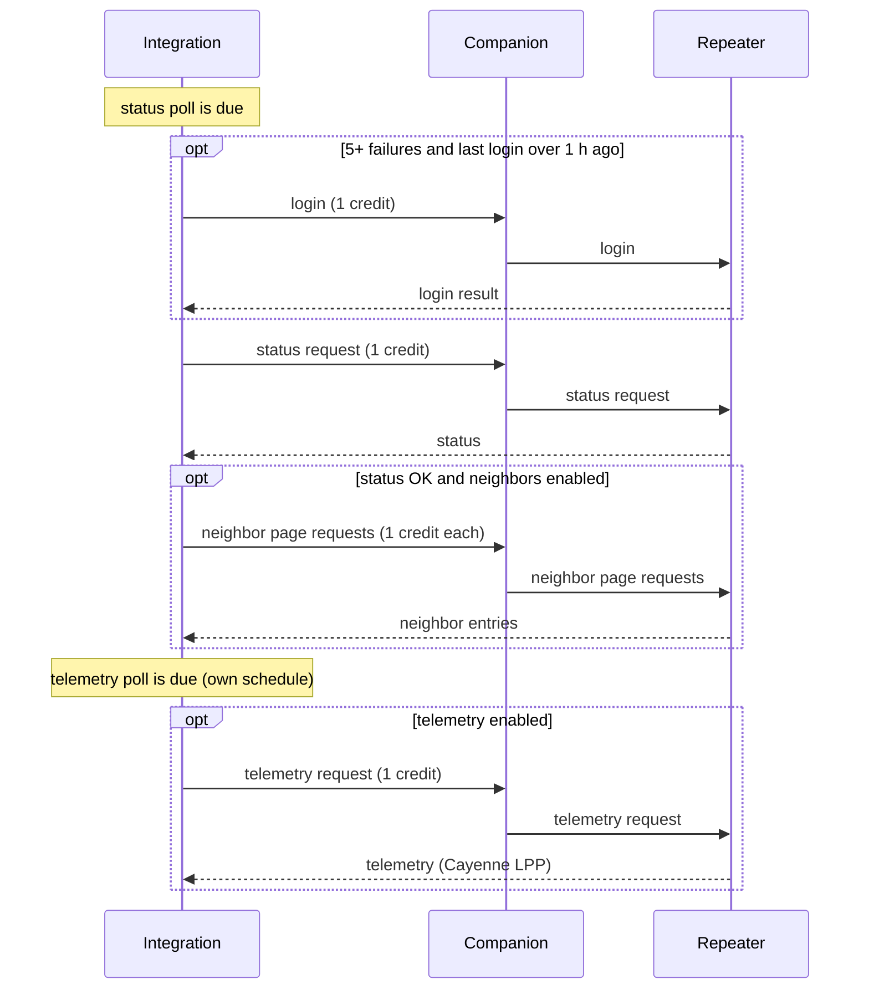

# Remote Node Tracking

The integration can monitor other nodes in your mesh. A node that you add for monitoring is a tracked node. The integration sends polls to each tracked node on a schedule and shows the results as sensors. For the terms on this page, see [Concepts](concepts.md).

| You add it with | Node types | Polls |
|---|---|---|
| **Add Repeater Station** | Repeaters, room servers, sensor nodes | Status, telemetry (optional), neighbors (optional), login when necessary |
| **Add Tracked Client** | Clients | Telemetry |

The node must be in the contact list of the companion. If a repeater is only a discovered contact, the form shows `Contact not found`. If a client is only a discovered contact, the integration adds it but cannot poll it.

## Add Repeater Station

1. Go to **Settings > Devices & services > MeshCore > Configure**.
2. Select **Add Repeater Station**.
3. Complete the form (see the table below).
4. Select **Submit**.

| Field | Default | Description |
|---|---|---|
| **Available Repeaters** | None | The node to track. The list shows repeaters, room servers, sensor nodes, and contacts with "repeater", "room server", "roomserver" or "sensor" in the name. |
| **Password** | Empty | The login password. Leave it blank for a node that gives access by ACL. |
| **Enable Telemetry Polling** | Off | Also send telemetry polls, at the same interval as the status polls. |
| **Enable Neighbor Entities (creates SNR and activity sensors for each neighbor seen by the repeater)** | Off | Read the neighbor list after each successful status poll. The UI gives MeshCore firmware 1.14.0 or later as the requirement. See [Repeater Neighbors](repeater-neighbors.md). |
| **Telemetry Refresh Rate (seconds)** | 7200 | The interval for all polls of this node. Minimum 300. |
| **Disable Path Reset** | Off | Do not reset the route to this node after failures. See [Route reset](#route-reset). |

When you select **Submit**, the integration logs in to the node with the password and asks for the firmware version. Each request costs one credit. If no credit is available for the version query, the integration skips it. The first status poll is due at once. The integration keeps the password for later logins.

| Error | Cause |
|---|---|
| `Repeater is already configured` | The node is a tracked node already. |
| `Device not connected. Please ensure the MeshCore device is connected.` | The companion is not connected. |
| `Contact not found` | The node is not in the contact list of the companion. |
| `Mesh traffic <lane> lane is empty. Try again in <seconds> seconds.` | The lane has no credit for the login. |
| `Failed to log in to repeater. Check password and try again.` | The node refused the login, or did not answer. |

## Add Tracked Client

1. Go to **Settings > Devices & services > MeshCore > Configure**.
2. Select **Add Tracked Client**.
3. Complete the form (see the table below).
4. Select **Submit**.

| Field | Default | Description |
|---|---|---|
| **Available Clients** | None | The client to track. |
| **Update Frequency (seconds)** | 7200 | The interval for telemetry polls. Minimum 300. |
| **Disable Path Reset** | Off | Do not reset the route to this node after failures. |

The integration sends no mesh traffic when you add a client. The first telemetry poll is due at once. The client firmware decides who can request its telemetry. If the client does not answer, make sure that its ACL allows your companion.

## Manage Monitored Devices

1. Go to **Settings > Devices & services > MeshCore > Configure**.
2. Select **Manage Monitored Devices**.
3. In **Select Device**, select a tracked node.
4. In **Action**, select **Edit Device Settings** or **Remove Device**.
5. Select **Submit**.

The edit forms have the same fields as the add forms, plus these fields:

| Field | Description |
|---|---|
| **Update Password (leave blank to keep current)** | Repeaters only. Leave it blank to keep the saved password. |
| **Disable Device** | Stop all polls to this node. The device and its entities stay in Home Assistant. |

When you save a repeater with **Disable Device** off, the integration logs in and asks for the firmware version again (one credit). If the query fails, the edit stays. The **Refresh firmware version** button of the repeater sends the same requests.

**Remove Device** stops all polls to the node and deletes the device and its entities. The node stays in the contact list of the companion.

An add, edit or remove applies at once, without a reload. The schedules of the other nodes do not change. A new interval applies from the next poll. When you disable neighbors, the integration removes all neighbor sensors.

## How the integration polls a node

Each node has a status schedule (repeaters, room servers, sensor nodes) and a telemetry schedule (clients, and repeaters with telemetry on). Both schedules use the interval of the node. Each poll starts after a random delay of 0 to 30 seconds.



Every poll costs one credit from a lane of the traffic budget. A poll with no credit waits for credit. It is not a failure. For the lanes and the requests that cost credit, see [Mesh Traffic Policy](traffic-policy.md). For installs from 2.x that still use the deprecated Legacy policy, see [Legacy traffic policy](legacy-traffic-policy.md).

## Failures

A failure is a poll that gets no answer, a send that fails, or a status with an uptime of 0. After each failure, the wait to the next attempt doubles, to a maximum of 24 hours. A node with a known route retries sooner than the normal interval. See [Retry spacing](traffic-policy.md#retry-spacing).

### Route reset

The route reset applies when a node with a known route has 3 or more failures in a row with no answer. The integration clears the route and sends up to 3 path discoveries, for one flood credit. If it finds no route, the next poll is a flood request. See [Route healing](traffic-policy.md#route-healing-governed).

The reset does not occur when **Disable Path Reset** is on. Enable this option when you set a fixed route with the `change_contact_path` command of `meshcore.execute_command`. See [CLI Command Reference](cli-commands.md).

### Login

The integration logs in to a node again before a status poll when the node has 5 or more status failures in a row. The last login must be more than 1 hour ago. A successful login resets the failure count.

### Auto-disable

If a tracked node has no successful request for 120 hours, the integration stops all its polls. The node resumes when you edit it or when the companion hears its next advert. See [Auto-disable](traffic-policy.md#auto-disable).

## Devices and entities

Each tracked node gets its own device, connected through the companion device. The device name is `MeshCore Repeater: <name> (<node pk6>)` or `MeshCore Client: <name> (<node pk6>)`.

Entity IDs use `<pk10>`, the first 10 characters of the node public key. They also use `<name>`, the node name in lower case with special characters as `_`.

| Entity | Example |
|---|---|
| Status sensors (repeater) | `sensor.meshcore_def456abc0_battery_percentage_myrepeater` |
| **Routing Path** | `sensor.meshcore_def456abc0_out_path_myclient` |
| **Path Length** | `sensor.meshcore_def456abc0_out_path_len_myclient` |
| **Request Successes** | `sensor.meshcore_def456abc0_request_successes_myrepeater` |
| **Request Failures** | `sensor.meshcore_def456abc0_request_failures_myrepeater` |
| **Online** | `binary_sensor.meshcore_def456abc0_online_myrepeater` |
| **Refresh firmware version** (repeater) | `button.meshcore_def456abc0_refresh_firmware` |
| **Neighbor Count** (neighbors on) | `sensor.meshcore_def456abc0_neighbor_count` |
| Telemetry sensors | `sensor.meshcore_def456abc0_ch1_temperature_myclient` |
| GPS tracker | `device_tracker.meshcore_def456abc0_gps_myclient` |

The integration creates telemetry sensors when the first data arrives, one for each Cayenne LPP value. For the full list of status sensor keys, see [Sensors](sensors.md).

### Availability

- Status and telemetry sensors become unavailable after 3 intervals with no new data (6 hours at 7200 seconds).
- **Online** is on when the last successful request is less than 2.5 intervals old. It is on at once after you add a node. After a restart, it is unknown until the first success.
- **Request Failures** counts failed polls and failed logins.

## Automation example

This automation sends a notification when a repeater does not answer:

```yaml
alias: Repeater offline
triggers:
  - trigger: state
    entity_id: binary_sensor.meshcore_def456abc0_online_myrepeater
    to: "off"
    for:
      minutes: 10
actions:
  - action: notify.notify
    data:
      title: Node offline
      message: "{{ state_attr(trigger.entity_id, 'friendly_name') }} is not answering."
```

For more examples, see [Automation](automation.md#sensor-automations).

## Solve problems

For problems with tracked nodes, see [Troubleshooting](troubleshooting.md#repeaters-and-polling).
