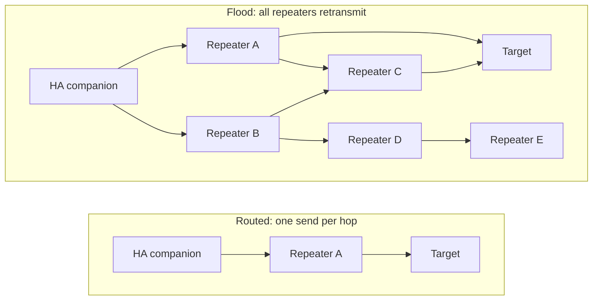
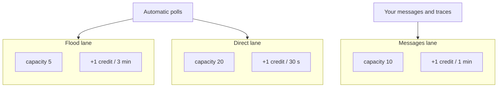
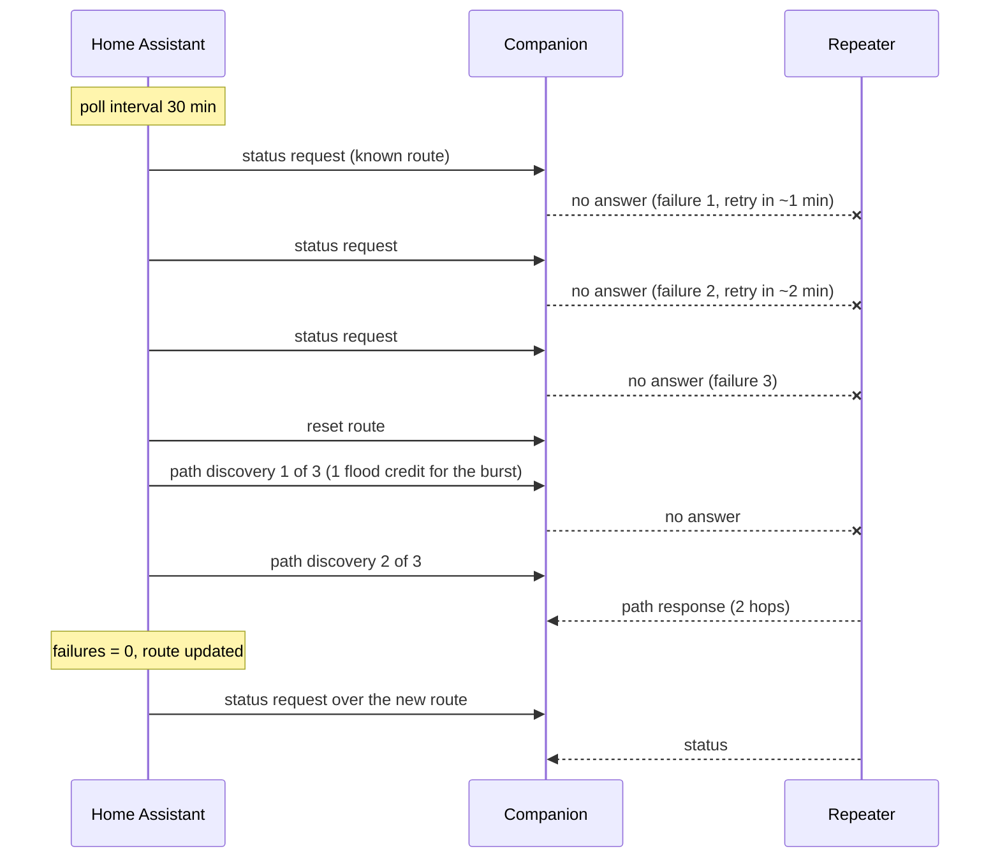

# Mesh Traffic Policy

The traffic policy limits the requests that the integration sends over the mesh: polls, logins, neighbor pages, path discoveries and messages. New entries use the **Governed** policy. For the terms on this page, see [Concepts](concepts.md).

## Why the integration limits mesh traffic

The mesh is shared. All nodes in range use one radio channel, and every repeater in range retransmits each flood request. Uncontrolled polls and retry loops from one installation can congest a busy mesh. Then the messages of other users do not get through.

Governed protects the mesh:

- It sets a fixed limit on the flood traffic of each companion.
- It gives routed requests a larger budget, because only the repeaters on the route retransmit them.
- It repairs a broken route immediately, in place of repeated floods.
- It backs off from nodes that do not answer.

On a busy mesh in September 2026, one installation at the full flood budget added approximately 2% to a channel load of 22%.

## Policy setting {#choosing-a-policy}

The setting is **Global Settings > Mesh Traffic Policy**. For installs from 2.x that still use the deprecated Legacy policy, see [Legacy traffic policy](legacy-traffic-policy.md).

## Routed and flood requests

A **routed** request uses a known route. The companion and each repeater on that route transmit it one time. A **flood** request has no route, so each repeater that receives it transmits it again. On a mesh with 50 repeaters in range, one flood request can cause 50 transmissions.



A contact has a known route when its `out_path_len` is 0 or more. The value 0 means that the companion hears the contact directly. The value `-1` means no route, so the request floods.

## The three lanes

All tracked nodes share one budget. If a lane is empty, the integration defers the poll.

| Lane | Burst capacity | Refill | One credit every | Carries |
|---|---|---|---|---|
| Flood | 5 | 20 / hour | 3 minutes | Requests to a node with no known route, the first poll after a route reset, route healing, `send_path_discovery`, adverts |
| Direct | 20 | 120 / hour | 30 seconds | Status, telemetry, login, neighbor pages and firmware queries over a known route |
| Messages | 10 | 60 / hour | 1 minute | `send_message`, `send_channel_message`, `trace` and the message commands of `execute_command`, on all routes |



A lane never uses credit from a different lane. Thus a burst of flood polls cannot stop routed polls or your messages.

### Metered requests

Each request in this table uses one credit:

| Request | Lane |
|---|---|
| Automatic status, telemetry and login of a tracked node | Flood or direct, from the route |
| Each neighbor page of a repeater | Flood or direct, from the route |
| Route healing (up to 3 path discoveries) | Flood, one credit for the full burst |
| `send_message`, `send_channel_message`, `trace` | Messages |
| **Add Repeater Station**: the login, then the firmware query (one credit each) | Flood or direct, from the route |
| **Edit Repeater** save and the **Refresh firmware version** button: the login and the firmware query together | Flood or direct, from the route |
| `execute_command`: mesh commands, for example `send_advert`, `send_msg` and `req_status` | Flood, messages, or from the route. See [CLI Command Reference: Traffic policy](cli-commands.md#traffic-policy). |

Other `execute_command` commands do not use credit.

### When a lane is empty {#when-a-lane-runs-dry}

The integration never sends an automatic poll without credit. It **defers** the poll to the time of the next credit of the lane, and records no failure. It logs this at INFO, one time per node per lane every 10 minutes:

```
Deferring status for myrepeater (flood lane empty, next at 2026-09-26T01:45:00+00:00)
```

Example: seven polls must flood in the first 2 minutes, for example after you add seven nodes with no route. The flood lane gets credits at minute 3, 6 and 9.

| Minute | What occurs | Flood credits after |
|---|---|---|
| 0 | Polls 1 to 5 use the burst | 0 |
| 1 | Poll 6 finds no credit. The integration defers it to minute 3. | 0 |
| 2 | Poll 7 finds no credit. The integration defers it to minute 3. | 0 |
| 3 | One credit arrives. Poll 6 uses it. Poll 7 finds no credit, and the integration defers it to minute 6. | 0 |
| 6 | One credit arrives. Poll 7 uses it. | 0 |

The integration cannot defer a **service call**. If the lane is empty, the call fails. The error gives the time to the next credit: a maximum of 180 seconds (flood), 30 seconds (direct) or 60 seconds (messages).

```
Mesh traffic messages lane is empty; try again in 60 seconds
```

## When a node does not answer {#when-a-node-stops-answering}

A poll fails when the node does not answer, or when it sends a status with an uptime of 0. Status polls and telemetry polls have separate failure counts.

| Condition | Action |
|---|---|
| 1 or more consecutive failures | Retry. See [Retry spacing](#retry-spacing). |
| 3 or more failures with no answer, and a known route | Reset the route. Then start [route healing](#route-healing-governed). |
| 5 or more status failures of a repeater | Send a new login before the next status poll, a maximum of one time each hour. The login uses the lane of that poll. |
| No successful request for 120 hours | [Auto-disable](#auto-disable) the node |

### Retry spacing

| Next attempt | Wait |
|---|---|
| Over a known route | `interval / 62 x 2^failures`, never more than the poll interval |
| Must flood (no route, or route healing found no route) | `interval x 2^failures`, +/-10% jitter, a maximum of 24 h |

Example: for a 30-minute poll interval, the routed retries come 58 s, 116 s and 232 s after the first three failures. Thus the integration resets a bad route in a few minutes.

### Route healing {#route-healing-governed}

After a route reset, the integration immediately sends up to three **path discoveries**. A path discovery asks the mesh for a new route. The full burst costs one flood credit.



- If a discovery finds a route, the failure count goes to 0. The next poll uses the new route.
- If no discovery finds a route, or the flood lane is empty, the next poll floods with the long backoff.
- Each discovery waits 15 to 30 s for an answer. Other requests wait during the burst, because the companion has one slot for a pending mesh request.
- The integration keeps the first route that answers. This can be the same weak route again. If healing finds the same weak route two or more times, [pin a better route](#pinning-a-route-and-turning-off-route-resets).

In a 4.7-hour test on a weak repeater, the longest gap between successful polls was 25 minutes, against up to 46 minutes without route healing.

### Pin a route {#pinning-a-route-and-turning-off-route-resets}

When **Disable Path Reset** is on for a tracked node, the integration never resets its route. Polls flood only when the companion has no route to the node.

To send requests through a specific repeater:

1. Set the route with the `change_contact_path` command of `meshcore.execute_command`. See [CLI Command Reference](cli-commands.md).
2. Enable **Disable Path Reset** for the node.

If you do not do step 2, three failures in a row will reset the route that you set.

### Auto-disable

When a repeater or a client has no successful request for **120 hours**, the integration disables its status and telemetry polls. The count starts when the entry starts, or when you add or edit the node. The log shows a warning:

```
Repeater myrepeater has had no successful requests in 120.0 hours. Automatically disabling to reduce network traffic. Edit the node or wait for its next advert to resume.
```

The node stays disabled after a restart. It resumes when one of these occurs:

- You edit the node in **Manage Monitored Devices** and select **Submit**, also with no change.
- The companion hears the node again: an advert, or a contact update from the node.

## State across restarts

Approximately 30 seconds after a change, the integration saves the node schedules, the failure counts, the auto-disabled nodes and the lane credits. At startup, it restores them and refills each lane for the downtime. Thus a restart does not give a new burst or reset a backoff.

## Monitor the budget {#watching-the-budget}

The **Request Rate Limiter** sensor, for example `sensor.meshcore_abc123_rate_limiter_tokens_mynode`, shows the credits of the direct lane. Its attributes:

| Attribute | Meaning |
|---|---|
| `policy` | `governed` |
| `flood_credits`, `direct_credits`, `messages_credits` | Credits that remain in each lane |
| `flood_capacity`, `direct_capacity`, `messages_capacity` | Burst size of each lane |
| `flood_refill_per_hour`, `direct_refill_per_hour`, `messages_refill_per_hour` | Refill rate of each lane |
| `flood_next_eligible`, `direct_next_eligible`, `messages_next_eligible` | Estimated ISO time (UTC) of the next credit, or `null` when the lane has a credit now |
| `deferred_nodes` | Each node that waits now, as `{name, lane, until}` |

The recorder does not save the credit, next-eligible or `deferred_nodes` attributes.

At the `info` log level, the integration also logs `Successfully reset path for <name>`, `Rediscovered path to <name> on attempt <n>: <hops> hops` and `No route to <name> after 3 path discoveries`.
